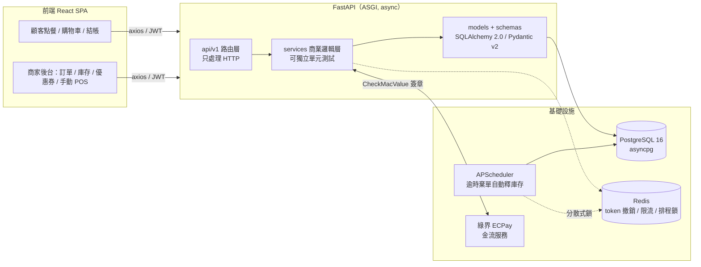
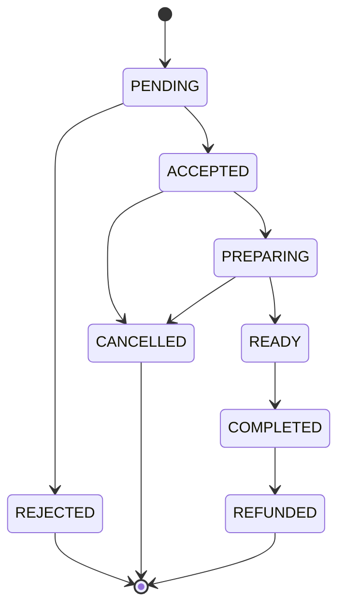

# 🍱 線上點餐自取系統（Online Ordering & Pickup System）

> 一個模擬真實餐飲店家「線上點餐 + 到店自取」場景的全端專案，重點不在把 CRUD 做完，
> 而在把**併發、資料一致性、金流串接、狀態機**這些餐飲/電商後台真正會踩到的坑，扎扎實實解決一遍。

<!-- 若 GitHub repo 名稱不同，請一併修改下方 badge 與連結中的 repo 路徑 -->
[](https://github.com/RaymondJhao/online-ordering-system-fastapi/actions/workflows/backend-ci.yml)


---

## 👋 關於我與這個專案

我是行銷／營運背景出身，正在轉職成為後端工程師。選擇「線上點餐系統」作為代表作，
不是因為它技術上很炫，而是因為**我曾經站在行銷活動第一線**，很清楚一場優惠活動、
一波尖峰時段訂單，會怎麼把一個「看起來能跑」的系統打垮——超賣、重複扣款、
庫存被惡意佔用，這些不是課本上的邊角案例，是真實會被顧客投訴、被主管追殺的商業事故。

這個專案是我用工程手法，把這些「行銷人最怕遇到的商業痛點」逐一解決的過程。

**這個版本是 Flask 版的完整重寫。** 原始的 Flask 實作在
[online-ordering-system](https://github.com/RaymondJhao/online-ordering-system)，
本 repo 保留了完整的 git history，可以直接看到從 Flask 演進到 FastAPI 的軌跡。
重寫的動機、取捨與過程中發現的既有缺陷，都記錄在
[架構決策紀錄（ADR）](docs/adr/) 與 [遷移計畫](docs/fastapi-migration-plan.md)。

**開發方式全公開**：本專案高度結合 **AI 輔助開發工具（Claude Code、Gemini）** 完成——
但 AI 負責的是「加速」，不是「替我思考」。我的角色是精準拆解需求、下 Prompt 規劃資料表
與 API 邊界、對 AI 產出的程式碼做 code review、追根究柢地除錯（例如 ECPay 簽章跟 .NET
URL encode 的編碼差異，就是人工比對官方文件一個字元一個字元 debug 出來的）。我認為
「會不會善用 AI 槓桿開發」本身就是這個時代後端工程師的核心能力之一，而不是需要隱藏的事。

---

## 🎯 這個專案在解決什麼商業問題

| 商業痛點（行銷/營運視角） | 對應的工程手法 |
| --- | --- |
| 促銷活動衝流量時，同一份庫存被兩筆訂單同時搶走，導致超賣、客訴 | 資料庫層級**原子扣減**，把「檢查庫存」與「扣減」合併成單一 UPDATE，用 `rowcount` 判斷成敗（[ADR 0005](docs/adr/0005-atomic-stock-deduction.md)） |
| 顧客網路延遲時連點兩次「送出訂單」，導致重複建單、重複扣款 | 基於 **Idempotency-Key** 的冪等性設計，含「兩個相同 key 同時衝過檢查」的極端併發處理 |
| 商家後台把訂單狀態亂改，造成內外場資訊對不上 | 嚴格的**訂單狀態機**，用轉移表明確定義合法路徑，非法轉移回 409 |
| 顧客下單後不去付款，庫存被「假裝要買」的訂單卡住 | **背景排程**每分鐘釋出逾時 15 分鐘未付款的訂單庫存，多 worker 下用 Redis 分散式鎖確保只執行一次 |
| 顧客竄改前端金額欺騙後端 | 後端**依資料庫單價重新計算**訂單總額，schema 根本不接受任何金額欄位 |
| 惡意流量打爆下單/付款 API | **Redis 滑動視窗限流**，Lua 腳本確保計數與寫入的原子性（[ADR 0006](docs/adr/0006-custom-rate-limiter.md)） |
| 使用者的 token 外洩後，攻擊者可以長期潛伏使用 | **Refresh token 輪替 + 重用偵測**，一旦偵測到舊 token 被重用即撤銷整條 token family（[ADR 0003](docs/adr/0003-self-implemented-jwt.md)） |

---

## 🏗️ 系統架構



**分層原則**：路由層只做三件事——呼叫 service、把領域例外轉成 HTTP 狀態碼、回傳序列化結果。
所有商業規則都在 service 層，因此可以不透過 HTTP client 直接測試。

**訂單狀態機**（`ALLOWED_TRANSITIONS`，定義於
[`backend/app/services/order_service.py`](backend/app/services/order_service.py)）：



訂單狀態（`OrderStatus`）與付款狀態（`PaymentStatus`）刻意**解耦成兩個獨立欄位**：
一筆訂單可以是「`ACCEPTED` 但 `UNPAID`」（商家先備料、顧客到店現金付款），
也可以是「`PENDING` 但 `PAID`」（線上刷卡已成功、商家尚未確認接單），
兩條狀態線各自演進、互不阻塞，才符合實際餐飲場景的收銀邏輯。

訂單進入 `REJECTED` / `CANCELLED` / `REFUNDED` 時，**佔用的庫存會自動回補**。

---

## 🔐 核心技術亮點

### 1. 併發正確性（本專案最值得看的部分）

原子扣庫存的正確性不是靠「我覺得這樣寫沒問題」，而是靠可重現的併發測試證明：

| 測試情境 | 期望結果 |
| --- | --- |
| 庫存 5，20 個並行請求各訂 1 份 | 恰好成功 5 筆、庫存歸零、只建立 5 筆訂單 |
| 庫存 10，15 個並行請求各訂 2 份 | 恰好成功 5 筆 |
| 庫存 7，10 個並行請求各訂 3 份 | 成功 2 筆、剩 1 份，庫存不會變成負數 |
| 相同 Idempotency-Key 的 5 個並行請求 | 只建立 1 筆訂單、庫存只扣一次 |

這些測試**刻意不使用共用 session 的 fixture**——那樣所有操作跑在同一筆交易裡，
天然沒有競爭，測了等於沒測。每個並行請求都有自己的連線與交易。

有效性用**突變測試**確認過：把原子扣減換回「先讀再判斷再寫」，
4 個測試中有 3 個立刻失敗。

→ [`backend/tests/test_order_concurrency.py`](backend/tests/test_order_concurrency.py)

### 2. 認證深度：refresh 輪替與重用偵測

FastAPI 的 `OAuth2PasswordBearer` 只負責從標頭取出 token 字串並在 OpenAPI 宣告
security scheme，token 怎麼簽、怎麼驗、怎麼撤銷都要自己實作。這一層做了：

- **access 15 分鐘 / refresh 7 天**，兩者皆帶 `jti`、`typ` 與 `family_id`
- **`typ` 欄位在驗證時檢查**——否則 refresh token 可直接當 access token 用，
  等於把 15 分鐘的曝險窗口放大成 7 天
- **`jwt.decode` 明確指定 algorithms**，擋下 `alg=none` 的 algorithm confusion
- **重用偵測**：Redis 用白名單記錄有效的 refresh jti，以 `GETDEL` 原子取用；
  取不到即判定 token 已外洩，撤銷整條 family，使用者與攻擊者一併登出
- **登出同時撤銷 access 與 family**——只撤銷 access 是不夠的，
  攻擊者持有 refresh token 下一秒就能換出新的

11 個安全性測試涵蓋過期、簽章竄改、`alg=none`、typ 混用、重用偵測、登出即時失效。

### 3. 第三方金流整合（綠界 ECPay）

- 完整實作 `CheckMacValue` 簽章演算法：參數排序 → 組字串 → URL encode → 修正
  **.NET 與 Python URL encode 在 `-`、`_`、`.`、`!`、`*`、`(`、`)` 這幾個字元上的編碼差異**
  → SHA256 → 轉大寫
- Callback 端點沒有登入者，身分完全靠驗證 `CheckMacValue` 確認——
  少了這道驗證，任何人都能自行 POST 一筆「付款成功」把訂單改成已付款
- 用 `CustomField1` 帶回 `order_id`，不從 `MerchantTradeNo` 反推（id 與 timestamp
  之間沒有分隔符，解析會有歧義）
- 回應必須是純文字 `1|OK`，回 JSON 會讓綠界判定通知失敗並持續重送

### 4. 系統穩定性

- **背景排程**：`AsyncIOScheduler` 由 lifespan 管理，每分鐘取消逾時未付款訂單並回補庫存。
  多 worker 環境下用 **Redis 分散式鎖**（`SET NX EX`）確保同一輪只有一個 worker 執行
- **限流**：Redis 滑動視窗，Lua 腳本保證原子性，回傳 `Retry-After` 與 `X-RateLimit-*`
- **健康檢查拆成 liveness / readiness**：`/health/live` 不碰相依服務，
  `/health/ready` 實際檢查資料庫與 Redis 並在不通時回 503。
  平台的健康檢查必須指向前者——否則資料庫故障會讓服務陷入重啟迴圈，
  而 liveness 的語意本來就是「要不要重啟我」而非「能不能給我流量」

### 5. 前端的 token 續期與錯誤處理

- **401 → refresh → 重試**的攔截器，且多個並行請求**共用同一個 refresh promise**。
  各自去 refresh 會觸發後端的重用偵測，結果不是續期而是撤銷整條 family——
  用自己的安全機制把使用者踢出去
- FastAPI 回的是 `detail` 而非 `message`，且 422 的 `detail` 是**陣列**。
  統一由 `extractErrorMessage()` 處理，並涵蓋 429 的 `Retry-After` 與逾時情境

### 6. 測試與工程紀律

- **121 個測試、約 93% 覆蓋率**，全部跑在真實 PostgreSQL 與 Redis 上而非模擬品
  （[ADR 0004](docs/adr/0004-unify-on-postgres.md) 說明為什麼）
- 測試資料庫結構由 **Alembic 建立**（`downgrade base` + `upgrade head`），
  每次測試都順帶驗證 migration 可正確升級與回滾
- **GitHub Actions CI**：ruff lint/format → pytest（含 Postgres + Redis service）
  → `alembic check`（擋下 model 與 migration 不同步）→ Docker 建置與啟動 smoke test
- **自動產生的 OpenAPI 3.1 文件**：從型別註記與 Pydantic model 產生，
  與驗證邏輯結構上不可能漂移

---

## 🔄 從 Flask 遷移到 FastAPI

這次重寫最大的收穫，是**逐行讀過舊程式碼時發現了四個原本就存在、卻沒被察覺的缺陷**：

| 發現的問題 | 影響 |
| --- | --- |
| `DateTime` 欄位沒有 `timezone=True`，但存入 aware datetime | 時區資訊被丟棄，背景排程拿它跟 aware 的 cutoff 比較，在 Postgres 上直接拋 `TypeError`——排程形同虛設 |
| 排程的 docstring 寫「把庫存釋放回去」，程式碼只有改狀態那一行 | 排程每跑一次，被取消訂單佔用的庫存就永久消失一次；它宣稱要解決的問題恰恰是它自己造成的 |
| 拒絕／取消訂單時不回補庫存 | 商家每拒絕一筆訂單就永久少掉那些庫存 |
| 測試 SQLite、開發 MySQL、正式 Postgres 三套並存 | 最需要被驗證的併發邏輯，恰好是測試最不可靠的部分 |

其他遷移過程中處理的事：

- `routes/order.py` 505 行 → 路由 168 + service 339 + schema 111，職責分離
- 手寫的 60 行 flasgger YAML docstring → Pydantic model，文件與驗證不再各寫一次
- `token_blocklist` 資料表（無清理機制、只增不減）→ Redis TTL 自動過期
- 導入 Alembic（舊版靠 `db.create_all()`，schema 一旦有資料就無法變更）
- 修掉「每次 commit 都變成全檔案重寫」的 CRLF 問題，git history 恢復可讀

完整的遷移計畫與逐階段紀錄：[docs/fastapi-migration-plan.md](docs/fastapi-migration-plan.md)

---

## 🔥 實際部署那一輪找到什麼

遷移時逐行讀舊程式碼，找出四個缺陷。**實際部署一輪，又找出十個。**

這一節記錄它們，但重點不是清單本身，而是一個更值得回答的問題：
**為什麼 121 個跑在真實 Postgres 與 Redis 上的測試、加上一份寫得很細的部署設定，
一個都沒攔住？** 十個缺陷依「為什麼本機抓不到」分類之後，答案就浮出來了。

### 只有乾淨環境才會暴露

| 缺陷 | 為什麼本機抓不到 |
| --- | --- |
| `pyproject.toml` 漏宣告 `pydantic[email]` | `EmailStr` 在**建立 model 類別時**就會 import `email_validator`。開發用的 venv 是長期累積出來的，從未在乾淨安裝下跑過一次完整 import。CI 第一次乾淨安裝就死在 conftest，而錯誤標題指向 conftest、真正的問題在 pyproject |
| Dockerfile builder 缺 `README.md` | `pyproject.toml` 宣告了 `readme = "README.md"`，hatchling 產 metadata 時會實際開檔，而 `.dockerignore` 把它排除了。只有 Docker 的精簡 build context 會踩到，錯誤訊息完全不提 Dockerfile |

### 只有讀官方文件才會知道

| 缺陷 | 為什麼危險 |
| --- | --- |
| `preDeployCommand` **只開放付費方案** | 免費方案設了不會執行。部署顯示成功、服務正常啟動，schema 卻從未建立——直到第一個碰資料庫的請求才失敗。而它最可能發生在每 30 天重建資料庫之後，也就是「以為流程跑完了」的時候。已改為併入 `startCommand` |
| 未釘住 `PYTHON_VERSION` | Render 的預設版本隨服務建立時間浮動（當時是 3.14.3），而 CI 與 Dockerfile 都是 3.12。等於正式環境跑一個從未驗證過的直譯器 |
| Key Value 未指定 `region` | 預設 `oregon`，而 web service 是 `singapore`。Render 私有網路以 region 為界，跨區連不到。**`/health/live` 照樣回 200**（它刻意不檢查相依服務），只有 `/health/ready` 看得出來——這也剛好驗證了把 liveness 與 readiness 分開的價值 |

### 只有真實流量才會暴露

| 缺陷 | 說明 |
| --- | --- |
| **綠界回調的中文欄位編碼** | 綠界的 `Content-Type` 不帶 charset，Starlette 因此以 Latin-1 解碼 body，`RtnMsg` 的「交易成功」變成 mojibake；再用 UTF-8 重新編碼算 `CheckMacValue`，算的是亂碼的雜湊，簽章永遠不符。改為自行以 UTF-8 解析 raw body，且 `keep_blank_values=True` 不可省——空值欄位也要參與簽章計算 |
| 前端誤用全域 `axios` | 兩個頁面直接呼叫 `axios.get()` 卻沒 import，是 Flask 時期以 `<script>` 載入的殘留。`npm run build` **不會擋**（Rollup 當它是外部全域），一進顧客首頁就 `ReferenceError`，畫面全白 |
| 列表回應解析全錯 | Flask 版回 `{items}`／`{orders}`／`{order}`，FastAPI 版的 `response_model` 直接回裸陣列與裸物件。結帳頁的 `orderRes.data.order.id` 拋 TypeError（**訂單其實已經建立成功**）；商家訂單、庫存、優惠券三處則是靜默失敗——HTTP 200、畫面永遠空白、完全不報錯 |
| 顧客登入被導向商家後台 | 商家後台登出時帶著 `state.from = "/merchant"`，而顧客分支無條件沿用 |
| CI 缺兩個測試環境變數 | `RATE_LIMIT_ENABLED` / `SCHEDULER_ENABLED` 預設都是 `true`，測試套件卻假設基準為關閉。症狀是隨機的 429 |
| `SimulatePaid=1` 未處理 | 綠界後台「模擬付款」發出的通知，官方明確要求不可變更訂單狀態。原本會被當成真實付款 |

### 歸納出的兩個測試盲點

這一節是整段裡最有價值的部分——它們是**結構性**的，不是漏寫幾個案例。

**① 自產自驗的測試等於沒測。**
金流測試用 `generate_check_mac_value` 產生簽章，端點再用**同一個函式**驗證。
簽章演算法即使完全寫錯，測試也會全過——它驗的是自我一致性，不是正確性。
修法是引入外部真值：補上綠界官方文件公布的標準向量與期望雜湊值。
（實測結果是演算法本身正確，問題在 body 解碼——但沒有這個測試就無法確定。）

**② 測試資料全是 ASCII，就測不到編碼路徑。**
所有回調測試自組的 payload 都不含中文，所以 Latin-1 解碼那個 bug 在結構上
就不可能被觸發。修法是用**原始 UTF-8 body 且不帶 charset** 送出，
完整重現綠界的送法。

### 診斷過程本身的紀錄

簽章那個 bug 花了最久，過程值得留下來：前兩個推論（「500 被 CORS 遮蔽」、
「冷啟動吞掉通知」）都被實際資料推翻，共同原因是在證據不足時往下推。
真正收斂的轉折是**停止推測、改為增加可觀測性**——為回調的每條分支加上日誌，
因為那個端點有三條路徑會回 `1|OK` 卻不更新任何資料，從外部無法區分
「通知沒送到」與「送到了但被丟棄」。

日誌一上線就把 mojibake 印出來了，然後用真實 payload 逐字重現：
綠界送來的雜湊值 = 用還原後的「交易成功」計算的結果，
我們算出的 = 用 mojibake 計算的結果。兩邊都吻合，沒有推測空間。

**教訓很簡單：未部署的部署設定，等於未寫。** 這十個缺陷沒有一個是靠更用力
寫測試就能預防的——它們需要的是一次真實的端到端執行。

---

## 🧰 技術棧

| 分類 | 技術 |
| --- | --- |
| 後端語言／框架 | Python 3.12、FastAPI（ASGI, async） |
| ORM／資料庫 | SQLAlchemy 2.0（async）、asyncpg、PostgreSQL 16、Alembic |
| 快取／限流 | Redis（token 撤銷、滑動視窗限流、排程分散式鎖） |
| 認證 | PyJWT + bcrypt 自行實作（refresh 輪替 + 重用偵測） |
| 驗證／文件 | Pydantic v2、pydantic-settings、自動產生 OpenAPI 3.1 |
| 背景任務 | APScheduler（AsyncIOScheduler） |
| 金流 | 綠界科技 ECPay（測試環境） |
| 測試／CI | pytest、pytest-asyncio、httpx、ruff、GitHub Actions |
| 前端 | React 19、Vite、Tailwind CSS、React Router、Axios |
| 前端測試 | Vitest、React Testing Library |
| 容器化／部署 | Docker（多階段建置）、docker-compose、Render |

---

## 📂 值得優先看的檔案

想快速了解這個專案的技術深度，建議照這個順序看：

1. [`backend/tests/test_order_concurrency.py`](backend/tests/test_order_concurrency.py) —
   併發下單測試，本專案最核心的正確性保證
2. [`backend/app/services/stock_service.py`](backend/app/services/stock_service.py) —
   原子扣庫存，含為什麼不能「先讀再判斷再寫」的完整說明
3. [`backend/app/services/auth_service.py`](backend/app/services/auth_service.py) +
   [`token_store.py`](backend/app/services/token_store.py) — refresh 輪替與重用偵測
4. [`backend/app/services/order_service.py`](backend/app/services/order_service.py) —
   訂單狀態機、冪等性、交易邊界
5. [`backend/app/core/rate_limit.py`](backend/app/core/rate_limit.py) —
   Redis Lua 滑動視窗限流
6. [`backend/app/utils/ecpay.py`](backend/app/utils/ecpay.py) — 綠界 CheckMacValue 簽章
7. [`docs/adr/`](docs/adr/) — 每個關鍵決策的取捨與代價

---

## 🚀 本機啟動方式

### 前置需求

- Python 3.12+
- Node.js 18+
- Docker（用於啟動 PostgreSQL / Redis）

### 1. 啟動資料庫與 Redis

```bash
cd backend
docker compose up -d
```

### 2. 後端

```bash
cd backend

python -m venv .venv
.venv\Scripts\activate            # Windows；macOS/Linux 用 source .venv/bin/activate

pip install -e ".[dev]"

cp .env.example .env              # 依說明填入 SECRET_KEY / JWT_SECRET_KEY
# 產生金鑰：python -c "import secrets; print(secrets.token_urlsafe(48))"

alembic upgrade head              # 建立資料表
python -m scripts.seed            # 建立測試帳號與情境訂單（可重複執行）

uvicorn app.main:app --reload     # http://localhost:8000
```

- 互動式 API 文件：`http://localhost:8000/docs`
- 健康檢查：`/health/live`（只確認行程存活）、`/health/ready`（含資料庫與 Redis）
- 預設測試帳號：`merchant@test.com` / `customer@test.com`，密碼均為 `test1234`

> **注意**：`SECRET_KEY` 與 `JWT_SECRET_KEY` 沒有預設值，也拒絕 `change-me`
> 這類佔位字串與長度不足 32 字元的值——沒設定就會直接啟動失敗。
> 這是刻意的：舊版有 dev fallback，忘記設定的正式環境會用一組公開在 GitHub 上的金鑰簽 JWT。

### 3. 執行測試

```bash
cd backend
pytest                            # 117 個測試，需要 docker compose 已啟動
pytest --cov --cov-report=term    # 含覆蓋率
ruff check . && ruff format --check .
```

測試會先 `alembic downgrade base` 再 `upgrade head` 重建結構，
因此**不要對著有重要資料的資料庫執行測試**。

### 4. 前端

```bash
cd frontend
npm install
cp .env.example .env.local        # 本機開發保持 VITE_API_BASE_URL 留空即可
npm run dev                       # http://localhost:5173
npm test                          # 前端測試
```

本機開發時 `VITE_API_BASE_URL` 留空，所有請求走相對路徑並由 Vite 的
dev proxy 轉發到 `http://localhost:8000`，因此不會有跨網域問題。

---

## 🚢 部署

前端在 **Vercel**，後端與 Redis 在 **Render**，資料庫用 Render PostgreSQL——
全部都是免費方案。這帶來三個實際的限制，處理方式與取捨完整記錄在
[ADR 0007](docs/adr/0007-free-tier-tradeoffs.md)。

### 已知限制（誠實說明）

| 限制 | 影響 | 本專案的處理 |
|---|---|---|
| Render Web Service 閒置 15 分鐘休眠 | 首位訪客需等 30–60 秒 | **刻意不做定時保溫**，改為進站即背景預熱 + 明確的等待提示（見下） |
| Render PostgreSQL 30 天到期 | 需手動重建，資料全失 | 重建流程自動化至只剩貼上連線字串（見下） |
| Render Redis 無持久化 | 重啟即清空 | **未解決**。Redis 一被清空，所有 refresh token 會被判定為重用而撤銷，全站使用者同時登出 |

第三點沒有在免費方案內的解法。真正的做法是付費的持久化 Redis，
或把 refresh 白名單搬回資料庫（代價是失去 TTL 自動清理）。這裡選擇接受並記錄，
而不是假裝它不存在。

### 為什麼不做保溫

Render 免費方案每月 750 instance hours，而一個月有 730 小時——24 小時保溫
會用掉幾乎全部額度。這是求職作品集，生命週期以月計算，
為一個註定會被閒置的展示站長期佔用額度並不划算。

既然接受冷啟動，就把它處理得體面：

- `App` 掛載時立刻在背景打 `/health/live` 預熱，使用者瀏覽菜單時後端已在啟動
- 等待超過 2 秒才顯示提示，避免熱機時閃一下反而干擾
- 明確告知「約需 30–60 秒，此為免費方案的休眠機制，非系統異常」
- axios timeout 設為 90 秒，否則第一個請求會在服務醒來前就失敗

### 後端（Render）

`render.yaml` 定義了 Web Service 與 Redis：

- 啟動指令為 `uvicorn`（FastAPI 是 ASGI，用 WSGI server 會直接失敗）
- `startCommand` 前面串了 `alembic upgrade head && python -m scripts.seed --if-empty`。
  **不用 `preDeployCommand` 是因為它只開放給付費方案**——免費方案設了不會執行，
  失敗模式是「部署成功但 schema 從未建立」，直到第一個查詢才炸。
  alembic upgrade 冪等且免費方案只有一個 instance，放在啟動指令是安全的；
  升級付費方案後應改回 `preDeployCommand`
- `PYTHON_VERSION` 固定為 `3.12.13`。Render 的預設版本會隨服務建立時間浮動
  （目前預設 3.14.3），不釘住等於正式環境跑一個 CI 從未驗證過的直譯器
- `healthCheckPath` 指向 **`/health/live`** 而非 `/health`——若健康檢查在資料庫
  不通時回 503，Render 會判定實例不健康而反覆重啟，而免費資料庫每 30 天
  就有一段重建空窗期
- `SECRET_KEY` / `JWT_SECRET_KEY` 由平台自動產生

`render.yaml` **刻意不宣告 `databases:`**：免費資料庫重建後連線字串會改變，
用 `fromDatabase` 綁定會讓 blueprint 與實際資料庫的對應關係斷掉。
資料庫改為手動建立，`DATABASE_URL` 設為 `sync: false`。

需要手動填入的環境變數：`DATABASE_URL`、`CORS_ORIGINS`、`CORS_ORIGIN_REGEX`、
以及四個 `ECPAY_*`。

### 🔁 每 30 天的資料庫重建 SOP

Render 免費 PostgreSQL 建立後 30 天到期，之後有 14 天寬限期，逾期資料刪除。
**建議在行事曆設一個每 28 天的提醒**——失敗模式是靜默的，
招募方看到錯誤頁不會寫信告訴你。

1. Render Dashboard → **New → PostgreSQL**，選 Free，記下建立日期
2. 進入新資料庫 → 複製 **Internal Database URL**
3. 到 `ordering-backend` 的 **Environment** → 把 `DATABASE_URL` 換成新的值 → Save
4. 存檔會自動觸發重新部署，`startCommand` 開頭會：
   - `alembic upgrade head` 建立所有資料表
   - `python -m scripts.seed --if-empty` 灌入展示帳號與情境訂單
5. 部署完成後打開 `/health/ready` 確認 `database` 與 `redis` 都是 `ok`
6. 刪除舊的資料庫

整個流程約 3 分鐘，不需要 shell，也不需要在本機做任何事。

`--if-empty` 讓 seed 對一般部署毫無作用（資料庫有資料就跳過），
只有重建後的第一次部署會實際執行——因此這行可以永遠留在啟動指令裡。

### 前端（Vercel）

`vercel.json` 已設定好 build 指令、輸出目錄與 SPA rewrites
（少了 rewrites，直接開啟 `/merchant` 或重新整理會得到 404）。

部署時**必須設定** `VITE_API_BASE_URL` 環境變數指向後端網址，例如
`https://ordering-backend.onrender.com`。沒設定的話 `/api/orders` 會打到
Vercel 自己的網域而得到 404。

對應地，後端的 `CORS_ORIGINS` 要加入 Vercel 的正式網域。
若也想讓 PR 的 preview 部署能運作，再設定 `CORS_ORIGIN_REGEX`，例如
`^https://online-ordering-[a-z0-9-]+\.vercel\.app$`——
preview 是隨機子網域，固定清單比對不到。

### 連線字串的自動正規化

雲端平台注入的 `DATABASE_URL` 是 `postgresql://`，還常附帶 `?sslmode=require`。
前者讓 async SQLAlchemy 拋「The asyncio extension requires an async driver」，
後者讓 asyncpg 拒絕未知參數——兩個錯誤訊息都很像「連線字串填錯」。

`app/core/config.py` 會自動補上 asyncpg driver 並清掉 libpq 專屬參數，
因此平台給的字串可以直接複製貼上。這件事在每 30 天重建時特別有感。

### Docker

也提供多階段 `Dockerfile`（非 root 使用者、healthcheck、相依層可快取），
CI 每次都會建置並做啟動 smoke test。

---

## 🗺️ 後續規劃（Roadmap）

誠實列出目前的已知限制與下一步方向。

**這些項目刻意留在 Roadmap 而非實作。** 它們都清楚、也知道怎麼做，
但這個專案的目標是把**核心正確性問題**（併發、金流、狀態機、認證）解決透徹，
而不是做成一個功能完整的產品。把已知限制寫清楚並說明取捨，
比把清單清空更能反映真實的工程情境——後者往往只是把邊界推到看不見的地方。

- [ ] 訂單列表分頁（目前一次性回傳全部，累積量大後需優化）
- [ ] `OrderStatusLog` 稽核紀錄表，追蹤誰在何時把訂單改成什麼狀態
- [ ] 優惠券補上使用次數上限、發放對象、起訖時間，支援行銷活動成效分析
- [ ] `update_order_status` 加上樂觀鎖，補齊與扣庫存一致的併發保護
- [ ] 限流改以登入者 id 而非 IP 識別（目前同一個 NAT 後的使用者會共用計數器）
- [ ] 結構化日誌與 request id，讓問題可以跨服務追蹤
- [ ] 前端元件測試覆蓋率
- [ ] 持久化的 Redis——目前免費方案重啟即清空，會導致全站使用者被登出
- [ ] 若專案需要長期營運，資料庫應改用無 30 天限制的方案並重新評估保溫策略

已完成（原 Roadmap 項目）：

- [x] 擴充測試覆蓋率——121 個測試、約 93% 覆蓋率，含併發、優惠券邊界、ECPay 驗簽失敗路徑

---

## 📜 授權

This project is licensed under the MIT License - see the [LICENSE](LICENSE) file for details.
