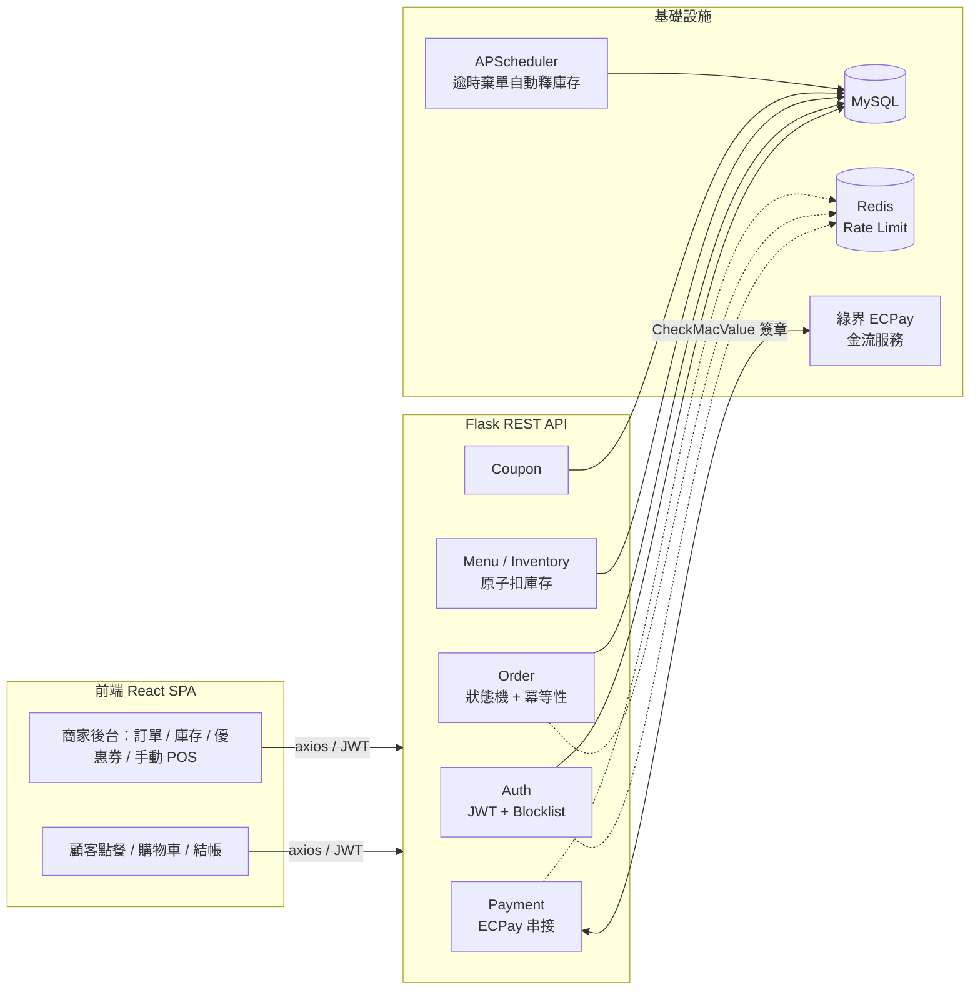
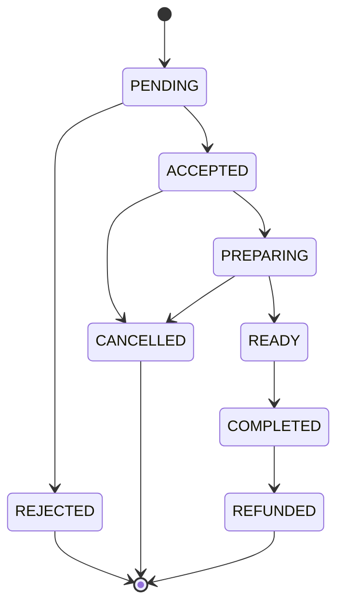

# 🍱 線上點餐自取系統（Online Ordering & Pickup System）

> 一個模擬真實餐飲店家「線上點餐 + 到店自取」場景的全端專案，重點不在把 CRUD 做完，
> 而在把**併發、資料一致性、金流串接、狀態機**這些餐飲/電商後台真正會踩到的坑，扎扎實實解決一遍。

[](https://github.com/RaymondJhao/online-ordering-system/actions/workflows/backend-ci.yml)


---

## 👋 關於我與這個專案

我是行銷／營運背景出身，正在轉職成為後端工程師。選擇「線上點餐系統」作為代表作，
不是因為它技術上很炫，而是因為**我曾經站在行銷活動第一線**，很清楚一場優惠活動、
一波尖峰時段訂單，會怎麼把一個「看起來能跑」的系統打垮——超賣、重複扣款、
庫存被惡意佔用，這些不是課本上的邊角案例，是真實會被顧客投訴、被主管追殺的商業事故。

這個專案是我用工程手法，把這些「行銷人最怕遇到的商業痛點」逐一解決的過程。

**開發方式全公開**：本專案高度結合 **AI 輔助開發工具（Claude Code、Gemini）** 完成——
但 AI 負責的是「加速」，不是「替我思考」。我的角色是精準拆解需求、下 Prompt 規劃資料表
與 API 邊界、對 AI 產出的程式碼做 code review、追根究柢地除錯（例如 ECPay 簽章跟 .NET
URL encode 的編碼差異，就是人工比對官方文件一個字元一個字元 debug 出來的）。我認為
「會不會善用 AI 槓桿開發」本身就是這個時代後端工程師的核心能力之一，而不是需要隱藏的事。

---

## 🎯 這個專案在解決什麼商業問題

| 商業痛點（行銷/營運視角） | 對應的工程手法 |
|---|---|
| 促銷活動衝流量時，同一份庫存被兩筆訂單同時搶走，導致超賣、客訴 | 資料庫層級**原子扣減**（Atomic Decrement），用 rowcount 判斷成敗，而非「先讀庫存、程式判斷、再寫回」 |
| 顧客網路延遲時連點兩次「送出訂單」，或手滑重複送出，導致重複建單、重複扣款 | 基於 **Idempotency-Key** 的冪等性設計，重送同一把 key 不會重複扣庫存 |
| 商家後台把訂單狀態亂改（例如已完成的訂單被打回準備中），造成內外場資訊對不上 | 嚴格的**訂單狀態機**，用轉移表明確定義合法路徑，非法轉移一律拒絕並回傳 409 |
| 顧客下單後不去付款，庫存被「假裝要買」的訂單卡住，其他人明明看得到菜單卻買不到 | **APScheduler** 背景排程，每分鐘自動釋出逾時 15 分鐘未付款的訂單庫存 |
| 顧客竄改前端金額欺騙後端 | 後端**依資料庫單價重新計算**訂單總額，完全不信任前端傳來的價格 |
| 惡意流量打爆下單/付款 API | **Flask-Limiter + Redis** 對關鍵端點做請求頻率限制 |

---

## 🏗️ 系統架構



**訂單狀態機**（`ALLOWED_TRANSITIONS`，定義於 [`backend/app/routes/order.py`](backend/app/routes/order.py)）：



訂單狀態（`OrderStatus`）與付款狀態（`PaymentStatus`）刻意**解耦成兩個獨立欄位**：
一筆訂單可以是「`ACCEPTED` 但 `UNPAID`」（商家先備料、顧客到店現金付款），
也可以是「`PENDING` 但 `PAID`」（線上刷卡已成功、商家尚未確認接單），
兩條狀態線各自演進、互不阻塞，才符合實際餐飲場景的收銀邏輯。

---

## 🔐 核心技術亮點

### 1. 高併發防護與資料一致性
- **原子扣庫存**：單一 SQL `UPDATE menu_items SET stock = stock - :q WHERE id = :id AND stock >= :q`，
  靠 `rowcount` 判斷扣減是否成功，杜絕「讀取-判斷-寫入」中間的競態空隙。
- **Idempotency-Key 冪等性**：下單 API 支援 `Idempotency-Key` header，重送同一把 key
  直接回傳原本的建單結果；連「兩個相同 key 的請求同時衝過檢查」這種極端併發，
  都用資料庫 unique constraint + `IntegrityError` 接住，確保絕不重複扣庫存。
- **後端金額重算**：`total_price` 一律由後端依資料庫單價與優惠券規則重新計算，不信任前端傳來的任何金額欄位。

### 2. 資安與權限控管（RBAC）
- JWT（`Flask-JWT-Extended`）區分 `customer` / `merchant` 兩種角色 claim，關鍵端點皆檢查角色。
- 每筆訂單操作都驗證「操作者是否為該筆訂單的擁有者」（`order.customer_id` / `order.merchant_id`
  是否等於當前登入者），防止跨帳號存取他人訂單（IDOR）。
- **JWT Blocklist 登出機制**：登出時將 token 的 `jti` 寫入 `TokenBlocklist` 資料表，
  搭配 `token_in_blocklist_loader` 讓已登出的 token 立即失效，而非純無狀態、永遠有效到過期為止。

### 3. 第三方金流整合（綠界 ECPay）
- 完整實作 `CheckMacValue` 簽章演算法：參數排序 → 組字串 → URL encode → 修正
  **.NET 與 Python URL encode 在 `-`、`_`、`.`、`!`、`*`、`(`、`)` 這幾個字元上的編碼差異** → SHA256 → 轉大寫。
- `ReturnURL` callback 端點**驗證 `CheckMacValue` 確認請求真的來自綠界**，而非任何人偽造的假付款通知。
- 用 `CustomField1` 可靠地帶回 `order_id`，不依賴解析 `MerchantTradeNo` 這種容易產生歧義的字串。
- Callback 判斷 `payment_status == UNPAID` 才更新為 `PAID`，天然具備冪等性，可安全承受綠界的重複通知。

### 4. 系統穩定性與自動化
- **Flask-Limiter + Redis**：下單、結帳等關鍵端點做請求頻率限制；並實作「先嘗試連線 Redis，
  連不上才 fallback 回 in-memory」的降級策略，避免 Redis 容器沒啟動就讓整個 API 掛掉。
- **APScheduler 背景排程**：每分鐘掃描一次，將建立超過 15 分鐘仍 `PENDING` 且 `UNPAID`
  的訂單自動轉為 `CANCELLED`，釋放被棄單佔用的庫存；排程邏輯包在 `app.app_context()` 內執行，
  並處理了 Flask debug reloader 會啟動兩個 process 導致排程重複執行的問題。

### 5. 測試與工程紀律
- `pytest` 撰寫後端整合測試，涵蓋 Auth、Menu 與高併發下單情境（建單成功、庫存不足、
  冪等性重送、狀態機非法跳躍防護）。
- **GitHub Actions CI**：push / PR 到 `main` 自動安裝依賴並跑 `pytest`，而非僅靠人工在本機驗證。
- **Swagger / OpenAPI 文件**（`flasgger`）：關鍵端點附有可互動的 API 文件，串接方不必逆向猜格式。

---

## 🧰 技術棧

| 分類 | 技術 |
|---|---|
| 後端語言／框架 | Python 3.10、Flask 3 |
| ORM／資料庫 | SQLAlchemy 2.0、MySQL 8（可替換 PostgreSQL） |
| 快取／限流 | Redis、Flask-Limiter |
| 認證 | Flask-JWT-Extended、Flask-Bcrypt |
| 背景任務 | APScheduler |
| 金流 | 綠界科技 ECPay（測試環境） |
| API 文件 | Flasgger（Swagger UI） |
| 測試／CI | pytest、pytest-flask、GitHub Actions |
| 前端 | React 19、Vite、Tailwind CSS、React Router、Axios |
| 前端測試 | Vitest、React Testing Library |
| 容器化 | Docker Compose（MySQL + Redis） |

---

## 📂 值得優先看的檔案

想快速了解這個專案的技術深度，建議照這個順序看：

1. [`backend/app/routes/order.py`](backend/app/routes/order.py) — 訂單狀態機、原子扣庫存、冪等性防護的核心
2. [`backend/app/tasks.py`](backend/app/tasks.py) — APScheduler 自動釋庫存排程
3. [`backend/app/utils/ecpay.py`](backend/app/utils/ecpay.py) — 綠界 CheckMacValue 簽章演算法
4. [`backend/app/routes/payment.py`](backend/app/routes/payment.py) — 金流 callback 驗簽與冪等更新
5. [`backend/tests/test_orders.py`](backend/tests/test_orders.py) — 高併發下單情境測試

---

## 🚀 本機啟動方式

### 前置需求
- Python 3.10+
- Node.js 18+
- Docker（用於啟動 MySQL / Redis，也可自行安裝本機服務）

### 1. 啟動資料庫與 Redis

```bash
cd backend
docker compose up -d
```

### 2. 後端

```bash
cd backend
python -m venv .venv
.venv\Scripts\activate        # Windows；macOS/Linux 請用 source .venv/bin/activate
pip install -r requirements.txt

cp .env.example .env          # 依需要調整 DATABASE_URL / REDIS_URL 等變數

python app.py                 # 啟動時會自動建表；預設 http://localhost:5000
```

- Swagger API 文件：`http://localhost:5000/apidocs`
- 執行測試：`pytest`

### 3. 前端

```bash
cd frontend
npm install
npm run dev                   # 預設 http://localhost:5173
```

- 執行前端測試：`npm test`

---

## 🗺️ 後續規劃（Roadmap）

誠實列出目前的已知限制與下一步優化方向：

- [ ] 訂單列表分頁（目前為一次性回傳全部，累積量大後需優化）
- [ ] `OrderStatusLog` 稽核紀錄表，追蹤誰在何時把訂單改成什麼狀態
- [ ] 優惠券模型補上使用次數上限、發放對象、起訖時間等欄位，支援行銷活動成效分析
- [ ] `update_order_status` 加上樂觀鎖（版本欄位）或 `SELECT FOR UPDATE`，補齊與扣庫存一致的併發保護
- [ ] 擴充測試覆蓋率：優惠券邊界情境、ECPay 驗簽失敗路徑、前端元件測試

---

## 📜 授權

MIT License
